## PyTorch Node Level Parallelism

### OpenMP
PyTorch can use OpenMP for on-node parallelizm and this is a good option on
Cori KNL nodes.  It is essential to configure OpenMP since when using the
defaults with MPI, the individual thread pools in each MPI rank oversubscribe the
available hardware and end up interfering with each other.


#### MPI+OpenMP
OpenMP provides a number of controls relating to thread pool size and affinity.
By default OpenMP will size thread pools to match the number of hyper-threads on
the system. On Cori KNL this is 272, which results in a system abort due to
exceeding a resource limit. This approach will lead to each rank on the node
creating 272 threads which would destroy performance when multiple ranks were
scheduled per node. Furthermore, in order to get good performance out of OpenMP
its threads need to be bound to a specific core. The following environment variables
control OpenMP thread pools and affinity:

|  variable | description |
| :---- | :---- |
| OMP_NUM_THREADS | Sets the per MPI rank thread pool size |
| OMP_PROC_BIND | Sets the thread affinity policy (true, false, close, spread)  |
| OMP_PLACES | Sets the hardware granularity used by the affinity (threads, cores, sockets) |

The recommended OpenMP affinity settings for running the deeplab AR detector on
Cori are
```
export OMP_PROC_BIND=true
export OMP_PLACES=threads
```
When used with the correct SLURM srun options, these settings enable binding
threads to cores and results in each thread being bound to a single CPU core.

In an MPI setting OpenMP threads on different MPI ranks should not be bound to
the same cores. OpenMP is not MPI aware and hence some inter-rank coordination
is needed. Inter-rank coordination of OpenMP thread binding can provided by the
SLURM srun command.

| option | description |
| :---- | :---- |
| -c N | allocates N hyper-threads per MPI rank |
| --cpu-bind=cores | generate masks that tell OpenMP which cores it should bind to |

Using these two options in conjunction result in SLURM generating bit masks
recognized by OpenMP that tell OpenMP which cores it can use on each MPI rank.
When used correctly each thread will be bound to a unique core, and no threads
will share any core.

The `-c` option sets the width of the affinity mask per rank. One should set it
to `n * OMP_NUM_THREADS` where `n` is the
number of hyper-threads for the given CPU architecture. On KNL `n` is 4 on Haswell
`n` is 2. `--cpu-bind=cores` must also be used to enable the generation of the
affinity mask.

#### Sizing the OpenMP thread pool for the deeplab AR detector
The preceding section describes how to control OpenMP thread pools but does
not provide any guidance on what size they should be. To gain insight into
setting the thread pool size we made a strong scaling study using a subset of
the above dataset. In these runs 248 time steps were processed on 8 nodes, using
62 ranks while the number of OpenMP threads was varied from 1 to 8.
The results are shown in the following figure.

| |
| :----: |
| 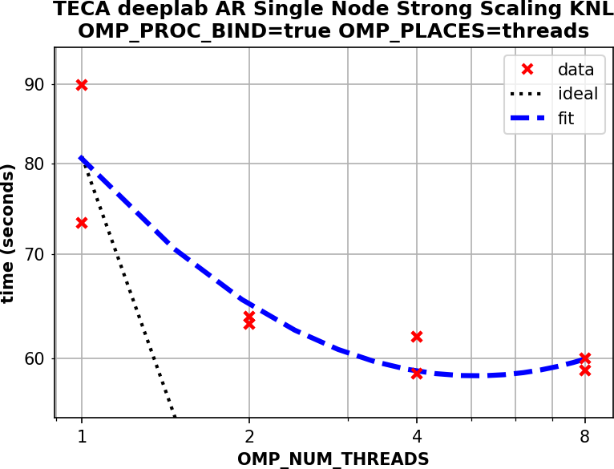 |

This data suggests that for this data on KNL nodes 4 OpenMP threads per rank is
a good choice. A similar study on Haswell nodes produced a similar result.

#### Assessing the impact of binding threads to cores

In order to compare between the defaults and using explicit OpenMP/SLURM thread
affinity settings described above two runs were made. `OMP_NUM_THREADS=4` was
set for both runs, but in the second run  `OMP_PROC_BIND=true`,
`OMP_PLACES=threads`, and `srun -c 16 --cpu-bind=cores` were also used.
Explicitly setting thread affinity and using SLURM generated masks was about 3
times faster as shown in the following plot.

| |
| :----: |
| 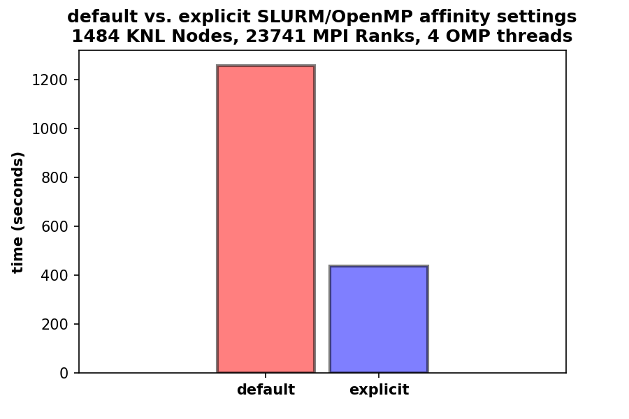 |

The following table shows the profiling results from two runs, one
without(first column) and one with with the correct SLURM/OpenMP threading
controls set(second column) as described above. The runs were made on the same
set of nodes in a single batch job.

| | |
|:----:|:----:|
| 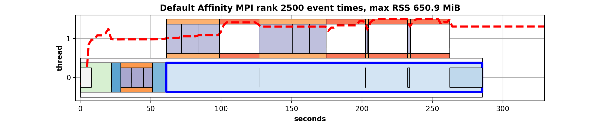    | 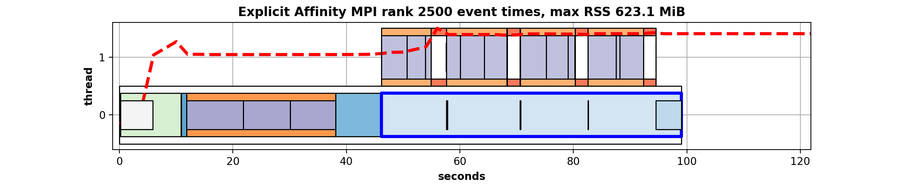 |
| 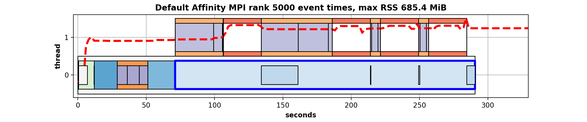    | 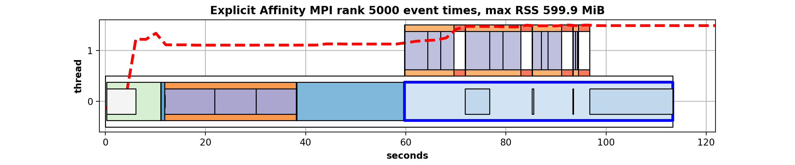 |
| 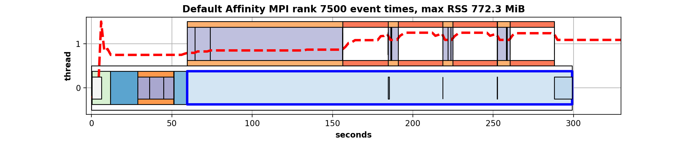    | 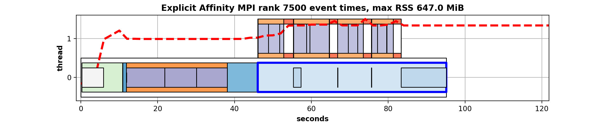 |
| 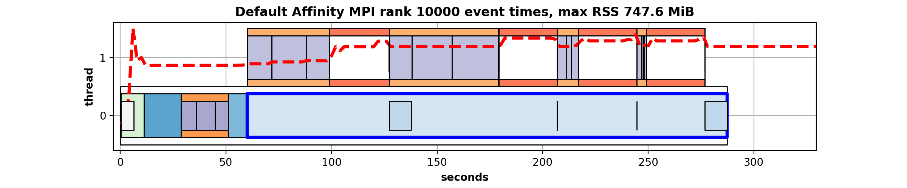   | 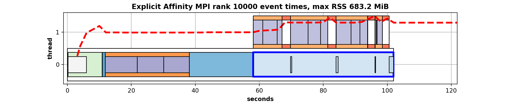 |
| 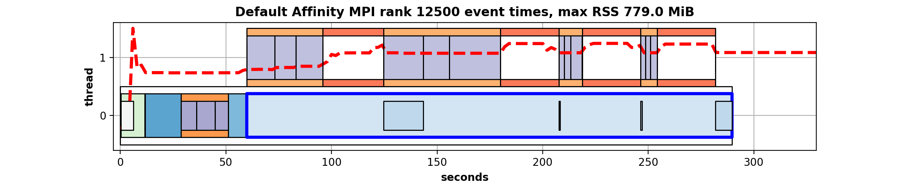   | 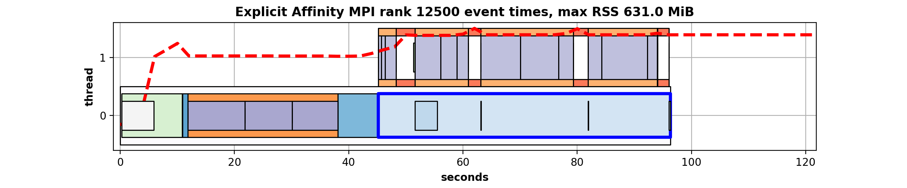 |
| 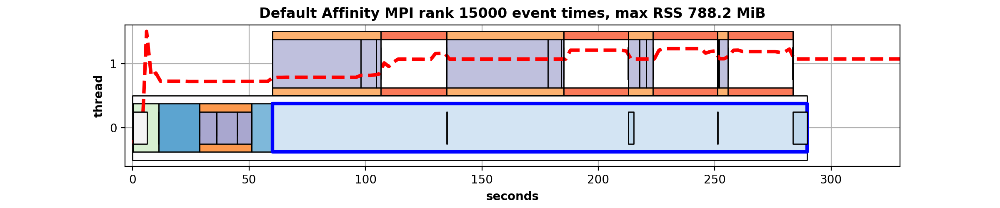   | 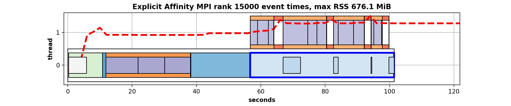 |
| 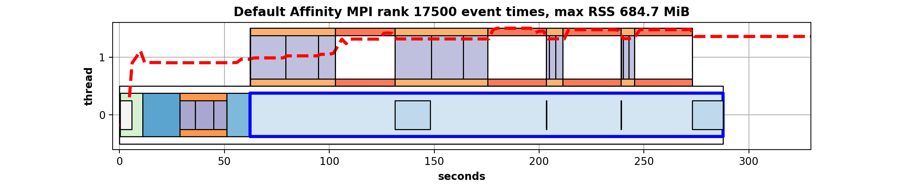   | 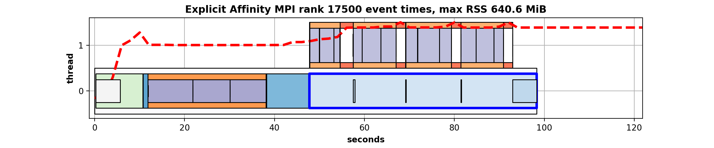 |
| 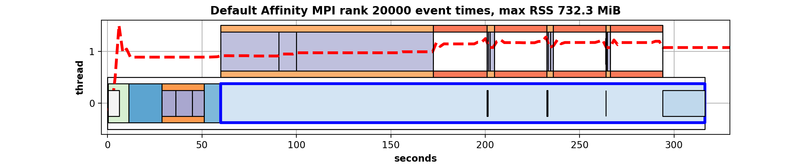   | 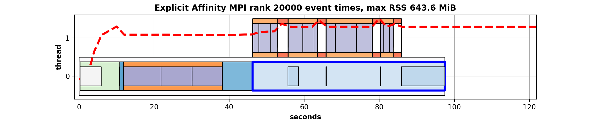 |

Each row in the table contains Gannt chart from 1 MPI rank. Each colored box
represents the time spent in a given operation. Note that TECA uses threads,
here 2 threads. PyTorch and hence OpenMP run on TECA thread 1. PyTorch
execution is shown by white boxes in TECA thread 1.  The left column of the
table shows data gathered from a run with the default settings and the right
column shows data from the run with `OMP_PROC_BIND=true`, `OMP_PLACES=threads`,
and `srun -c 16 --cpu-bind=cores`.  The important features to notice are that
both the total run time (~120s vs ~320sec) and the time spent in PyTorch (white
boxes) is significantly less when using the appropriate SLURM/OpenMP affinity
controls.

#### Illustrative example
The script [2_deeplab_AR_detect.sh](2_deeplab_AR_detect.sh) illustrates the use
of SLURM/OpenMP threading and affinity controls in a 1484 node, 23741 MPI ranks
job. 16 MPI ranks were scheduled per node, with each rank using an OpenMP
thread pool of 4 threads.

#### Troubleshooting
<dl>
<dt><b>
Thread creation failed
</b></dt>
<dd>
If you encounter the message:
<i>
libgomp: Thread creation failed: Resource temporarily unavailable
</i>
you likely have forgotten to set OMP_NUM_THREADS. This occurs because
during start up OpenMP will attempt to create thread pools with the
available number of hyper-threads(272 on KNL, 64 on Haswell) in each MPI
rank. One must set the environment variable before launching the detector.
</dd>
<dt><b>
Could not initialize NNPACK
</b></dt>
<dd>
The message:
<i>
[W NNPACK.cpp:80] Could not initialize NNPACK! Reason: Unsupported hardware.
</i>
is safe to ignore. This occurs when the necessary CPU features are not present.
Currently AVX extensions and L3 cache are required to use NNPACK. KNL CPUs do
not have L3 cache hence the NNPACK is not usable there.
</dd>
</dl>
